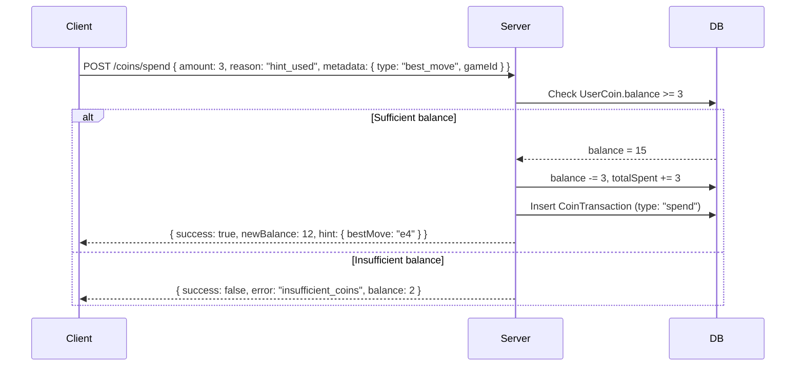
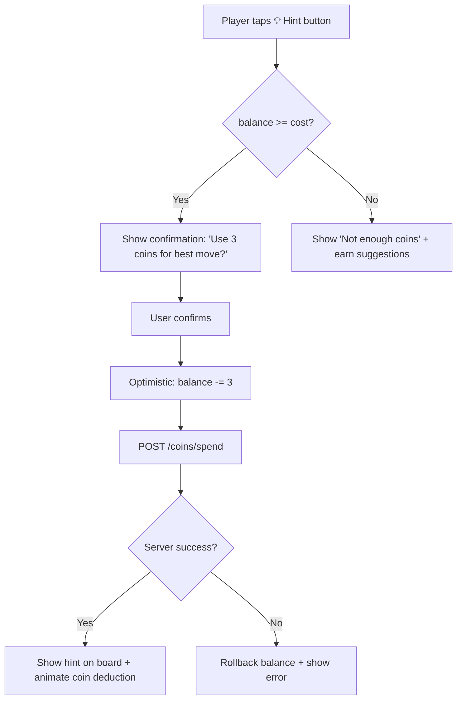
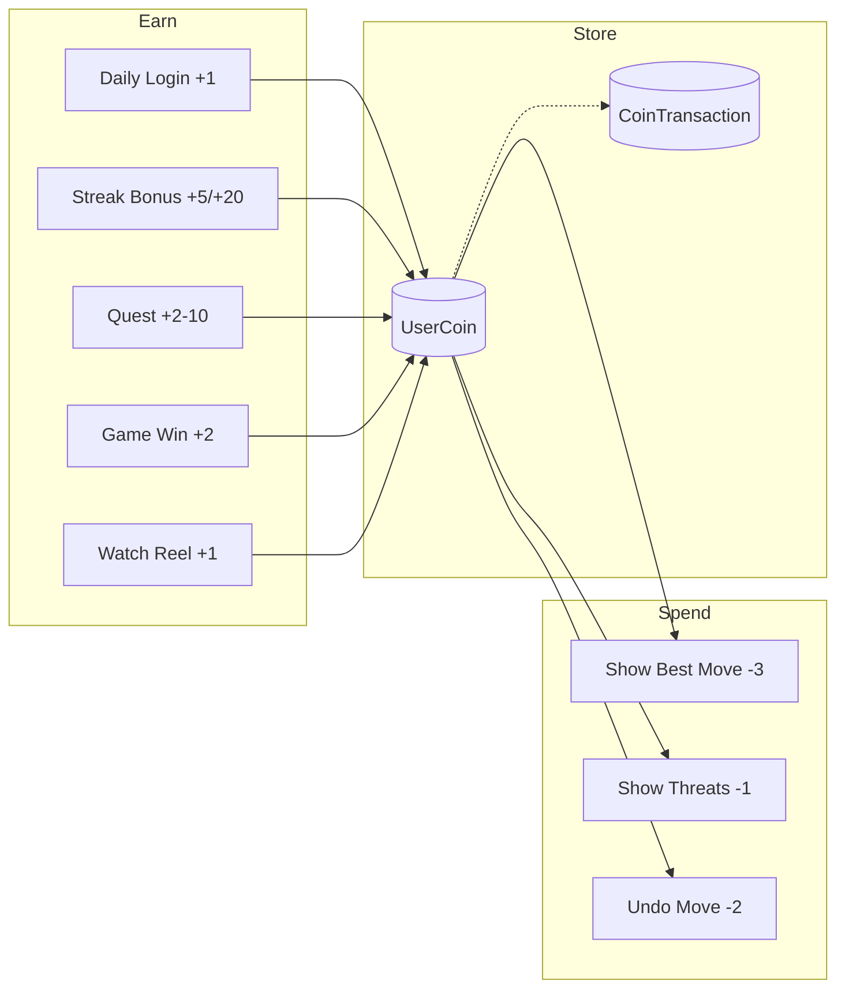

# 🪙 Coin System Design — DecayChess

## Overview

A virtual currency ("Coins") that rewards user engagement (login, quests, streaks, games) and can be spent on in-game perks like **hints during interactive challenges**. The system is designed to fit the existing Express + MongoDB backend and React Native (Expo) + Zustand client.

---

## 1. Data Model (MongoDB)

### 1.1 `UserCoin` — Balance Tracker

A dedicated model (similar to `UserStreak`) to store each user's coin balance.

```js
// server/models/UserCoin.js
const userCoinSchema = new mongoose.Schema({
    userId:       { type: ObjectId, ref: "User", required: true, unique: true },
    balance:      { type: Number,   default: 0,  min: 0 },
    totalEarned:  { type: Number,   default: 0 },   // lifetime earned
    totalSpent:   { type: Number,   default: 0 },   // lifetime spent
}, { timestamps: true });
```

| Field | Purpose |
|---|---|
| `balance` | Current spendable coins |
| `totalEarned` | Analytics — tracks all-time earnings |
| `totalSpent` | Analytics — tracks all-time spending |

### 1.2 `CoinTransaction` — Ledger / Audit Log

Every earn or spend event is recorded as an immutable transaction. This prevents disputes and makes debugging easy.

```js
// server/models/CoinTransaction.js
const coinTransactionSchema = new mongoose.Schema({
    userId:    { type: ObjectId, ref: "User", required: true, index: true },
    type:      { type: String, enum: ["earn", "spend"], required: true },
    amount:    { type: Number, required: true },
    reason:    { type: String, required: true },
    // e.g. "daily_login", "streak_bonus", "quest_complete",
    //      "game_win", "hint_used"
    metadata:  { type: mongoose.Schema.Types.Mixed, default: {} },
    // e.g. { gameId: "...", challengeId: "...", questId: "..." }
}, { timestamps: true });

coinTransactionSchema.index({ userId: 1, createdAt: -1 });
```

> [!TIP]
> The `reason` field uses a controlled enum-like set of strings so you can easily query analytics (e.g. "how many coins were spent on hints this week?").

---

## 2. Earning Mechanics

### Coin Reward Table

| Trigger | Coins | Frequency Cap | Reason Key |
|---|---|---|---|
| **Daily Login** | +1 | Once per calendar day | `daily_login` |
| **Streak Milestone** (7-day) | +5 | Once per milestone hit | `streak_bonus_7` |
| **Streak Milestone** (30-day) | +20 | Once per milestone hit | `streak_bonus_30` |
| **Quest Completed** | +2–10 | Per quest (one-time) | `quest_complete` |
| **Game Win** | +2 | Per game | `game_win` |
| **Game Draw** | +1 | Per game | `game_draw` |
| **Tournament Win** | +10 | Per tournament | `tournament_win` |
| **Watch Reel** | +1 | Max 5 per day | `reel_watched` |
| **First Interactive Challenge** | +3 | One-time | `first_challenge` |

> [!NOTE]
> All values are configurable. Consider storing them in a `CoinConfig` collection or a config file so admins can tune the economy without code changes.

### Integration Points (Server-Side)

| Existing Controller | Where to Hook |
|---|---|
| [streakController.js](file:///d:/codes/chesstest/DecayChess-integrated/server/controllers/streakController.js) → [recordActivity()](file:///d:/codes/chesstest/DecayChess-integrated/server/controllers/streakController.js#50-143) | After streak update, check milestones & award `streak_bonus_*` |
| Auth route → login success | Award `daily_login` (idempotent, once per day) |
| [game.controller.js](file:///d:/codes/chesstest/DecayChess-integrated/server/controllers/game.controller.js) → game result handler | Award `game_win` / `game_draw` |
| [tournament.controller.js](file:///d:/codes/chesstest/DecayChess-integrated/server/controllers/tournament.controller.js) → tournament end | Award `tournament_win` |
| [engagementController.js](file:///d:/codes/chesstest/DecayChess-integrated/server/controllers/engagementController.js) → reel view | Award `reel_watched` (with daily cap) |

---

## 3. Spending Mechanics

### Hint System in Interactive Challenges

| Action | Cost | Description |
|---|---|---|
| **Show Best Move** | −3 coins | Reveals the engine's top move on the board |
| **Show Threatened Pieces** | −1 coin | Highlights pieces under attack |
| **Undo Last Move** | −2 coins | Reverts the last move in a challenge |

### Spend Flow



> [!IMPORTANT]
> The balance check + deduction must be **atomic** (use `findOneAndUpdate` with `{ balance: { $gte: amount } }` filter) to prevent race conditions and double-spending.

---

## 4. API Endpoints

All routes go under a new `/coins` router, protected by the existing auth middleware.

| Method | Endpoint | Description |
|---|---|---|
| `GET` | `/coins/balance` | Get current balance + totals |
| `GET` | `/coins/history?page=1&limit=20` | Paginated transaction history |
| `POST` | `/coins/spend` | Spend coins (hint purchase) |
| `POST` | `/coins/earn` | **Internal only** — called by other controllers, not exposed publicly |

### Example Response — `GET /coins/balance`

```json
{
  "balance": 42,
  "totalEarned": 120,
  "totalSpent": 78
}
```

### Example Response — `GET /coins/history`

```json
{
  "transactions": [
    { "type": "earn",  "amount": 1,  "reason": "daily_login",  "createdAt": "2026-02-27T10:00:00Z" },
    { "type": "spend", "amount": 3,  "reason": "hint_used",    "createdAt": "2026-02-27T10:05:00Z", "metadata": { "type": "best_move" } }
  ],
  "page": 1,
  "totalPages": 3
}
```

---

## 5. Server Architecture

### New Files

| File | Purpose |
|---|---|
| `server/models/UserCoin.js` | Balance model |
| `server/models/CoinTransaction.js` | Transaction ledger |
| `server/controllers/coinController.js` | `getBalance`, `getHistory`, `spendCoins`, `earnCoins` |
| `server/router/coinRoutes.js` | Route definitions |
| `server/services/coinService.js` | Reusable `awardCoins(userId, amount, reason, metadata)` and `deductCoins(...)` functions |

### Core Service Functions

```
coinService.awardCoins(userId, amount, reason, metadata?)
  → Atomically increments balance & totalEarned
  → Inserts CoinTransaction { type: "earn" }
  → Returns updated balance

coinService.deductCoins(userId, amount, reason, metadata?)
  → Atomically decrements balance (only if balance >= amount)
  → Increments totalSpent
  → Inserts CoinTransaction { type: "spend" }
  → Returns { success, newBalance } or throws InsufficientBalanceError
```

> [!TIP]
> By centralizing earn/spend logic in `coinService.js`, any controller can award or deduct coins with a single function call, keeping the codebase DRY.

---

## 6. Client Architecture

### 6.1 New Zustand Store — `coinStore.ts`

Follows the same pattern as [authStore.ts](file:///d:/codes/chesstest/DecayChess-integrated/client/app/lib/stores/authStore.ts) and [reelStore.ts](file:///d:/codes/chesstest/DecayChess-integrated/client/app/lib/stores/reelStore.ts).

```
coinStore.ts
├── State
│   ├── balance: number
│   ├── totalEarned: number
│   ├── totalSpent: number
│   ├── transactions: CoinTransaction[]
│   └── isLoading: boolean
│
├── Actions
│   ├── fetchBalance()       → GET /coins/balance
│   ├── fetchHistory(page)   → GET /coins/history
│   ├── spendCoins(amount, reason, metadata)  → POST /coins/spend
│   └── updateBalance(delta) → Optimistic local update
│
└── Persist: balance only (via SecureStore)
```

### 6.2 UI Integration Points

| Screen | Integration |
|---|---|
| **Profile** ([profile.tsx](file:///d:/codes/chesstest/DecayChess-integrated/client/app/(main)/profile.tsx)) | Show coin balance badge |
| **Home** | Show coins in header / toolbar |
| **Game variants** (e.g. [decay.tsx](file:///d:/codes/chesstest/DecayChess-integrated/client/app/(game)/variants/decay.tsx)) | "Use Hint" button → calls `spendCoins()` |
| **Streak Master** ([streak-master.tsx](file:///d:/codes/chesstest/DecayChess-integrated/client/app/(main)/streak-master.tsx)) | Show "+5 coins!" toast on milestone |
| **New "Coin History" screen** | Paginated transaction list |

### 6.3 Hint UX Flow



---

## 7. Anti-Abuse & Edge Cases

| Concern | Safeguard |
|---|---|
| **Double-earn on login** | Server checks if a `daily_login` transaction already exists for today |
| **Reel farming** | Cap at 5 `reel_watched` per day using `countDocuments` |
| **Race condition on spend** | Atomic `findOneAndUpdate` with `balance >= amount` condition |
| **Negative balance** | `min: 0` on schema + atomic check prevents going below zero |
| **Quest replay** | Store completed quest IDs per user; reject duplicates |
| **Admin manipulation** | Admin panel can add/remove coins via a special `admin_adjustment` reason for auditability |

---

## 8. Future Considerations

- **Coin Shop** — Let users spend coins on cosmetics (board themes, piece skins)
- **Leaderboard** — "Most coins earned this week" for engagement
- **Daily/Weekly Quests** — Admin-configurable quests with variable rewards
- **Multiplier Events** — Double coins weekends tied to a feature flag
- **Gifting** — Send coins to friends (with rate limits)

---

## Summary



> [!NOTE]
> This design keeps the coin system **modular** — a dedicated service, store, and model — so it doesn't bloat existing controllers. Each existing feature hooks into the coin system via a single `coinService.awardCoins()` call.
