# Chess Reel Interactive Feature — Production Integration Plan

A detailed summary of everything built in the prototype, the full architecture, and a prioritized plan for integrating this feature into the production app.

---

## What Was Built (Prototype Summary)

An Expo React Native feature where a **vertical video reel pauses at a predefined timestamp**, opens an **interactive chess board** loaded from a FEN position, and **continuously evaluates using Stockfish**. If the evaluation collapses below a threshold, the session ends and the reel resumes.

### Architecture Diagram

```mermaid
graph TB
    subgraph "App.js (Entry Point)"
        RP["ReelPlayer"]
        IS["InteractiveSession"]
        ES["EngineService (hidden)"]
    end

    subgraph "State (Zustand)"
        GS["useGameStore"]
    end

    subgraph "Engine Layer"
        WV["Hidden WebView"]
        SF["Stockfish WASM"]
        EC["EvaluationController"]
    end

    RP -->|"startSession(fen)"| GS
    RP -->|"watches sessionStatus"| GS
    IS -->|"reads eval, moves, status"| GS
    IS --> CB["ChessBoard"]
    CB -->|"makeMove(from, to)"| GS
    GS -->|"isEvaluating=true"| ES
    ES -->|"postMessage(fen)"| WV
    WV --> SF
    SF -->|"score + bestMove"| WV
    WV -->|"onMessage"| ES
    ES -->|"updateEvaluation(score, bestMove)"| GS
    GS -->|"makeBotMove(bestMove)"| GS
    GS -->|"classifyEval → fail?"| GS
    GS -->|"endSession()"| RP
```



---

## Complete File Inventory

| # | File | Lines | Purpose |
|---|------|-------|---------|
| 1 | [App.js](file:///d:/codes/chess_App/chess/App.js) | 70 | Entry point — composes ReelPlayer + InteractiveSession + EngineService |
| 2 | [useGameStore.js](file:///d:/codes/chess_App/chess/src/store/useGameStore.js) | 196 | Central Zustand store — FEN, chess.js instance, moves, eval, session lifecycle, bot logic |
| 3 | [ChessBoard.js](file:///d:/codes/chess_App/chess/src/components/ChessBoard.js) | 277 | 8×8 tap-to-move board with Unicode pieces, legal-move highlights, coordinate labels |
| 4 | [ReelPlayer.js](file:///d:/codes/chess_App/chess/src/components/ReelPlayer.js) | 315 | expo-video full-screen reel, trigger-timestamp pause, session launch CTA, auto-resume |
| 5 | [InteractiveSession.js](file:///d:/codes/chess_App/chess/src/components/InteractiveSession.js) | 471 | Modal overlay — eval bar, status badge, chess board, move history, best-move suggestion |
| 6 | [EngineService.js](file:///d:/codes/chess_App/chess/src/services/EngineService.js) | 274 | Hidden WebView running Stockfish WASM, postMessage bridge, eval orchestration |
| 7 | [EvaluationController.js](file:///d:/codes/chess_App/chess/src/services/EvaluationController.js) | 109 | Pure logic — thresholds, score classification, UCI parsing utilities |

**Additional assets:**
- [stockfish-worker.html](file:///d:/codes/chess_App/chess/src/assets/stockfish-worker.html) — Local HTML for WebView engine
- `public/stockfish.js` — Stockfish WASM served via Metro dev server

---

## Dependency Inventory

| Package | Version | Purpose |
|---------|---------|---------|
| `expo` | ~54.0.33 | Framework |
| `expo-video` | ^3.0.15 | Video playback for reels |
| `chess.js` | ^1.4.0 | Move validation, FEN parsing, legal move generation |
| `zustand` | ^5.0.11 | Lightweight state management |
| `react-native-webview` | ^13.16.0 | Hidden WebView for Stockfish |
| `stockfish.js` | ^10.0.2 | Stockfish WASM engine |
| `expo-status-bar` | ~3.0.9 | Status bar styling |

---

## Feature Behavior Summary

### User Flow
1. **Video reel plays** full-screen in vertical format
2. At a **configurable trigger timestamp** → video pauses
3. "Interactive Challenge!" card appears with a **pulsing CTA button**
4. User taps **"⚔ Start Challenge"** → chess session opens as a modal overlay
5. User plays moves via **tap-to-select, tap-to-move**
6. **Stockfish evaluates every position** (depth 12) in real-time
7. A **bot opponent** automatically responds with the engine's best move
8. **Best move suggestion** shown below the board ("💡 Best move: e2 → e4")
9. If evaluation drops below:
   - **−0.8 pawns** → ⚠ WARNING (yellow badge)
   - **−1.5 pawns** → ✕ COLLAPSED (red badge, session ends after 1.2s)
10. On session end → overlay **animates out** → video **resumes** playback

### Key Technical Decisions Already Made
- **Stockfish in hidden WebView** (avoids native builds, runs WASM in web worker)
- **chess.js for move validation** (pure JS, no native dependencies)
- **Zustand for state** (minimal boilerplate, selector-based re-renders)
- **Unicode piece rendering** (no image assets needed)
- **Auto-queen promotion** (simplified for prototype)

---

## Production Integration Roadmap

> [!IMPORTANT]
> The sections below are ordered by priority. Items marked 🔴 are blocking for production, 🟡 are important but not blocking, 🟢 are nice-to-have polishes.

### 🔴 P0 — Backend Integration

#### Reel Metadata API

Currently, reel data is hardcoded in `App.js`:  
```js
const REEL_DATA = {
  videoUri: '...BigBuckBunny.mp4',
  triggerTimestamp: 10,
  fen: 'r1bqkbnr/...',
  playerColor: 'b',
  title: '🎯 Italian Game Trap',
  description: 'Black to move — can you survive?',
};
```

**Production change:** Fetch reel metadata from your existing backend API. Each reel document should include:

```js
{
  _id: ObjectId,
  videoUrl: String,         // CDN URL for the video
  triggerTimestamp: Number,  // Seconds into the video
  chessFen: String,         // Starting FEN position
  playerColor: String,      // 'w' or 'b'
  title: String,
  description: String,
  difficultyRating: Number, // Optional: 1-5 stars
  solutionMoves: [String],  // Optional: correct move sequence
}
```

#### Files to modify:
- **Backend:** Add `chessFen`, `triggerTimestamp`, `playerColor` fields to your existing Reel model/schema
- **Frontend:** Replace static `REEL_DATA` in `App.js` with data from your API response
- **`ReelPlayer.js`:** Accept `reelData` prop dynamically (already designed for this)

---

### 🔴 P1 — Stockfish Asset Bundling

Currently, `stockfish.js` is served from the Metro dev server's `public/` folder and fetched via HTTP at runtime. This **won't work in production builds**.

**Options (pick one):**

| Option | Pros | Cons |
|--------|------|------|
| **A. Bundle as Expo asset** | Works offline, no server needed | Increases app bundle by ~1.5MB |
| **B. CDN-hosted Stockfish** | Small app bundle, easy updates | Requires internet, CORS setup |
| **C. React Native Stockfish native module** | Best performance, no WebView | Requires dev build (no Expo Go) |

> [!WARNING]
> Option A is recommended for initial production. Option C is the long-term best approach for performance but requires ejecting from Expo Go.

#### Files to modify:
- `EngineService.js` → Update `buildEngineHTML()` to use bundled asset URI or CDN URL
- `stockfish-worker.html` → May need path adjustments
- `app.json` → Add asset plugin config if bundling

---

### 🟡 P2 — Error Handling & Edge Cases

The prototype has minimal error handling. For production:

| Area | Current | Production Need |
|------|---------|----------------|
| Engine init | Console error, silent fail | User-visible retry button, fallback to no-engine mode |
| WebView crash | Unhandled | Auto-restart WebView, notify user |
| Network video | Assumes video loads | Loading spinner, error state, retry |
| Invalid FEN | chess.js throws | Validate FEN server-side, graceful fallback |
| Session timeout | None | Add configurable max session duration |
| Move undo | Not supported | Add undo-last-move button |
| Promotion | Auto-queen | Show piece-selection modal |

#### Files to modify:
- `EngineService.js` → Add retry logic, timeout handling
- `ReelPlayer.js` → Add video loading/error states  
- `useGameStore.js` → Add undo, timeout, and error state fields
- `InteractiveSession.js` → Add error UI and undo button

---

### 🟡 P3 — Performance & UX Polish

| Item | Detail |
|------|--------|
| **Engine depth** | Currently fixed at 12. Make configurable per reel difficulty |
| **Board animations** | Add piece-sliding animation (currently teleports) |
| **Sound effects** | Move sounds, capture sounds, session-end sound |
| **Haptic feedback** | On piece selection, legal moves, captures |
| **Board themes** | User-selectable board and piece styles |
| **Evaluation bar animation** | Smooth transitions instead of jumps |
| **Move notation** | Convert bot suggestion from UCI to SAN (e.g., "e2e4" → "e4") |
| **Session scoring** | Track wins/losses/blunders per user |

---

### 🟢 P4 — Testing

> [!NOTE]
> The prototype has **zero tests**. For production, you need at minimum:

| Test Type | What to Test | Tool |
|-----------|-------------|------|
| **Unit** | `classifyEval()`, `evaluatePosition()`, `parseUCIScore()` | Jest |
| **Unit** | `useGameStore` actions (startSession, makeMove, makeBotMove, updateEvaluation) | Jest + Zustand testing |
| **Component** | ChessBoard renders correct FEN, tap-to-move works | React Native Testing Library |
| **Integration** | Full reel → pause → chess → eval → end flow | Detox or manual testing |
| **Manual** | Run on physical iOS/Android device, test video + chess + engine cycle | Physical device |

#### Suggested test commands:
```bash
# Install test deps
npm install --save-dev jest @testing-library/react-native

# Run unit tests
npx jest --testPathPattern="src/"

# Run all tests
npx jest
```

---

### 🟢 P5 — Deployment Considerations

| Item | Detail |
|------|--------|
| **Expo Build** | Use `eas build` for production builds (requires WebView → dev build, not Expo Go) |
| **App config** | Update `app.json` with proper bundle ID, version, icons |
| **Stockfish licensing** | Stockfish is GPL — verify compliance for your distribution model |
| **Video CDN** | Ensure reel videos are served from a CDN with proper caching headers |
| **Analytics** | Track: session starts, completion rate, average eval score, time-in-session |

---

## Verification Plan

### Automated Tests
1. **Unit tests for EvaluationController** — Run `npx jest src/services/EvaluationController.test.js`
2. **Unit tests for useGameStore** — Run `npx jest src/store/useGameStore.test.js`
3. **Build verification** — Run `npx expo export --platform web` to verify production build compiles

### Manual Verification
1. Run `npx expo start` and open on a physical device via Expo Go
2. Verify video plays → pauses at trigger timestamp  
3. Tap "Start Challenge" → chess board opens with correct FEN
4. Play legal moves → verify evaluation updates  
5. Make a blunder → verify session ends → reel resumes
6. Test on both iOS and Android
