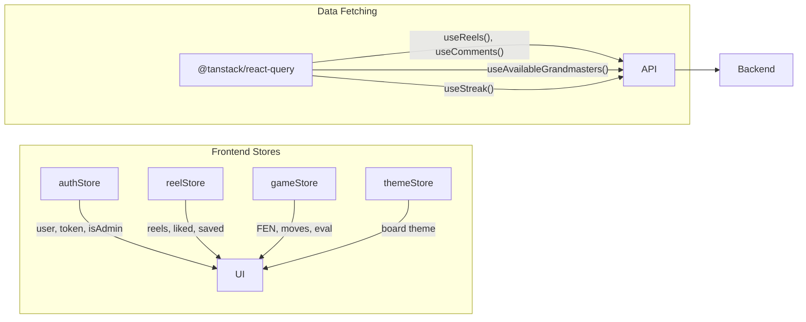

# 🎯 ChessTest — Project Handover Document

**Last Updated:** February 16, 2026  
**Project:** Interactive Chess Reels (Instagram-style chess learning app)  
**Stack:** React Native (Expo) + Node.js (Express) + MongoDB  
**Repo:** [github.com/Devx-RGS/chesstest](https://github.com/Devx-RGS/chesstest)

---

## 📁 Project Structure

```
chesstest/
├── backend/                     # Express.js API server
│   ├── config/                  # DB connection & env vars
│   ├── controllers/             # 6 controllers (auth, admin, reel, engagement, streak, data)
│   ├── middleware/               # auth.js (JWT verification)
│   ├── models/                  # 8 Mongoose models
│   ├── routes/                  # 6 route files
│   ├── public/                  # Static assets (videos, images)
│   ├── uploads/                 # User-uploaded files
│   ├── seed.js                  # Database seeder
│   └── server.js                # Express app entry point
│
├── frontend/                    # Expo (React Native) mobile app
│   ├── app/                     # File-based routing (Expo Router)
│   │   ├── (auth)/              # Login & registration screens
│   │   ├── (tabs)/              # Main tabs: Home, Reels, Profile
│   │   └── admin/               # Admin: Dashboard, Upload, Folders
│   ├── components/              # Reusable components
│   │   ├── chess/               # ChessBoard, EvalBar, InteractiveSession
│   │   ├── reels/               # ReelCard, CommentsBottomSheet, ReelActions
│   │   ├── ui/                  # AnimatedButton, GlassCard, SettingsSidebar
│   │   └── admin/               # AdminAuthGuard
│   ├── services/                # API clients & engine
│   ├── stores/                  # Zustand state management
│   ├── constants/               # Theme colors, board themes
│   └── types/                   # TypeScript type definitions
```

---

## 🔧 How to Run

### Backend
```bash
cd backend
npm install
# Create .env with: MONGO_URI, JWT_SECRET, JWT_EXPIRES_IN, ADMIN_EMAIL, ADMIN_PASSWORD, PORT
npm run dev          # Starts Express with --watch on http://localhost:5000
npm run seed         # Seed database with sample data
```

### Frontend
```bash
cd frontend
npm install
# Create .env with: EXPO_PUBLIC_API_URL (e.g. http://192.168.x.x:5000)
npx expo start       # Starts Expo dev server
```

---

## ✅ Feature List — What's Been Implemented

### 1. 🔐 Authentication System

| Feature | Backend | Frontend |
|---------|---------|----------|
| User Registration (email + password + username) | `authController.js` → `register()` | `(auth)/register.tsx`, `(auth)/signup.tsx` |
| User Login (JWT-based) | `authController.js` → `login()` | `(auth)/login.tsx` |
| Admin Login (hardcoded credentials from .env) | `authController.js` → `login()` | `admin/login.tsx` |
| Logout | `authController.js` → `logout()` | Profile screen button |
| Profile Setup (name, avatar, bio, chess rating) | `authController.js` → `setupProfile()` | Settings sidebar |
| Account Deletion | `authController.js` → `deleteAccount()` | Settings sidebar |

**How it works:**
- JWT tokens are generated on login and stored in `expo-secure-store` on the frontend.
- `verifyToken` middleware protects user routes; `verifyAdmin` middleware protects admin routes.
- Admin is a special user defined by `ADMIN_EMAIL` and `ADMIN_PASSWORD` env vars — there's no admin registration.
- The `authStore.ts` (Zustand) manages auth state, auto-loads tokens from secure storage, and provides `isAuthenticated`/`isAdmin` flags.

---

### 2. 🎬 Reels (TikTok-Style Video Feed)

| Feature | Backend | Frontend |
|---------|---------|----------|
| Paginated feed of published reels | `reelController.js` → `getReels()` | `(tabs)/reels.tsx` |
| Full-screen vertical scroll (snap-to-item) | — | `FlatList` with `pagingEnabled` + `snapToInterval` |
| Video playback (play/pause/mute) | — | `ReelCard.tsx` using `expo-av` |
| View counting (2s threshold, once per session) | `reelController.js` → `recordView()` | `ReelCard.tsx` → `handleView()` |
| Like / Unlike (optimistic UI) | `engagementController.js` → `likeReel()` | `reelStore.ts` + `useReelStore` |
| Save / Unsave (optimistic UI) | `engagementController.js` → `saveReel()` | `reelStore.ts` + `useReelStore` |
| Pull-to-refresh | — | `RefreshControl` in `reels.tsx` |
| Share | — | React Native `Share` API |
| Auto-pause on screen blur | — | `useFocusEffect` in `reels.tsx` |

**How it works:**
- `Reel` model stores video URL, thumbnail, content metadata (title, description, tags, difficulty), engagement counts, and references to `ChessGame` and `grandmasters`.
- The `reelStore.ts` (Zustand) holds the active reels list, liked/saved sets, and provides optimistic update functions. Likes/saves update locally first, then sync with the backend.
- `UserLike` and `UserSave` are separate MongoDB collections that track per-user like/save records (prevents duplicates).
- **Guest view tracking** uses a randomly generated session ID (no login required to watch reels).

---

### 3. 👑 Grandmasters Section

| Feature | Backend | Frontend |
|---------|---------|----------|
| List available grandmasters with reel counts | `reelController.js` → `getAvailableGrandmasters()` | `useAvailableGrandmasters()` hook |
| Filter reels by grandmaster name | `reelController.js` → `getReelsByGrandmaster()` | `useReelsByGrandmaster()` hook |
| Grandmaster tab in reels screen | — | `reels.tsx` → Grandmasters tab with card grid |
| Auto-populate from player names on upload | `adminController.js` → `uploadVideo()` | — |

**How it works:**
- Each `Reel` has a `grandmasters: [String]` array field. When a reel is uploaded with player names (e.g., "Magnus" and "Gukesh"), both names are stored in this array.
- The API returns distinct grandmaster names from all published reels + their reel counts.
- On the frontend, the "Grandmasters" tab shows a grid of cards; tapping one filters reels to that grandmaster.
- The `Grandmaster` model (separate collection) is used by the admin for folder management.

---

### 4. 💬 Comments System

| Feature | Backend | Frontend |
|---------|---------|----------|
| Create top-level comments | `engagementController.js` → `createComment()` | `CommentsBottomSheet.tsx` |
| Reply to comments (threaded) | `engagementController.js` → `createComment()` with `parentCommentId` | `CommentsBottomSheet.tsx` |
| Delete comments (cascade replies) | `engagementController.js` → `deleteComment()` | `CommentsBottomSheet.tsx` |
| Fetch comments for a reel | `engagementController.js` → `getCommentsByReel()` | `useComments()` hook |

**How it works:**
- `Comment` model has `reelId`, `userId`, `parentCommentId` (for threading), `text`, `likes`, `repliesCount`, and `isDeleted`.
- Deleting a parent comment recursively deletes all replies and updates the reel's engagement comment count.
- Bottom sheet slides up from the reel to show comments.

---

### 5. ♟️ Interactive Chess Feature

| Feature | Backend | Frontend |
|---------|---------|----------|
| Chess puzzles embedded in reels | `Reel.interactive` field (FEN, trigger time, player color, solution moves) | `InteractiveSession.tsx` |
| Touch-based chess board | — | `ChessBoard.tsx` (drag or tap to move) |
| Move validation (chess.js) | — | `gameStore.ts` → `makeMove()` |
| Stockfish AI opponent | — | `EngineService.tsx` (WebView + Stockfish WASM) |
| Evaluation bar | — | `EvalBar.tsx` + `EvaluationController.ts` |
| Game-over detection (checkmate, stalemate, draw) | — | `gameStore.ts` → `checkGameOver()` |
| Session collapse on bad moves | — | Eval drops below -4.5 pawns → session ends |
| Admin-controlled player color (force white/black/choice) | `Reel.interactive.playerColor` | `upload.tsx` → color picker |
| Custom challenge prompts | `Reel.interactive.challengePrompt` | `upload.tsx` → prompt input |
| Retry / Go back buttons | — | `InteractiveSession.tsx` → game-over overlay |

**How it works:**
- The `Reel` model has an `interactive` subdocument with `chessFen`, `triggerTimestamp`, `playerColor`, `solutionMoves[]`, `challengePrompt`, and `difficultyRating`.
- When a reel plays and hits the `triggerTimestamp`, the video pauses and the `InteractiveSession` modal opens.
- `chess.js` library handles FEN parsing, legal move generation, and game-over detection on the frontend.
- `EngineService.tsx` runs Stockfish via a hidden WebView loading `stockfish-worker.html`. It communicates positions via `postMessage` and receives evaluations/best moves back.
- `EvaluationController.ts` parses UCI protocol output, classifies eval scores (excellent/good/warning/collapsed), and provides threshold constants.
- `gameStore.ts` (Zustand) manages the full chess session lifecycle: start → player moves → engine responds → eval updates → game-over/collapse detection.
- Board supports 3 themes: wood, marble, neon (defined in `constants/themes.ts`).

---

### 6. 🔥 Streak System

| Feature | Backend | Frontend |
|---------|---------|----------|
| Track daily login streaks | `streakController.js` → `recordActivity()` | `streakApi.ts` |
| Get current/longest streak | `streakController.js` → `getStreak()` | Home screen + Profile |
| Auto-reset on missed days | `streakController.js` → consecutive day logic | — |

**How it works:**
- `UserStreak` model stores `currentStreak`, `longestStreak`, and `lastActiveDate` per user.
- On login, the frontend calls `POST /streak/record`. If the last active date was yesterday, streak increments. If today, no change. Otherwise, streak resets to 1.
- Streak data is shown on the Home screen and Profile screen.

---

### 7. 🏠 Home Screen

| Feature | Frontend File |
|---------|---------------|
| Personalized greeting (Good Morning/Afternoon/Evening) | `(tabs)/index.tsx` → `getGreeting()` |
| Streak display (current + longest) | `useStreak()` hook |
| Quick stats (reels watched, puzzles solved) | `authStore` user data |
| "Watch Reels" CTA button | Routes to Reels tab |

---

### 8. 👤 Profile Screen

| Feature | Frontend File |
|---------|---------------|
| User info display (name, email, avatar, bio) | `(tabs)/profile.tsx` |
| Chess rating display | From `User.profile.chessRating` |
| Stats cards (reels watched, puzzles, followers, following) | From `User.stats` |
| Settings sidebar (edit profile, logout, delete account) | `SettingsSidebar.tsx` |
| Admin badge for admin users | Based on `isAdmin` flag |

---

### 9. 🛠️ Admin Panel

| Feature | Backend | Frontend |
|---------|---------|----------|
| Admin login (separate from user login) | `authController.js` → admin check | `admin/login.tsx` |
| Upload reels (video URL + metadata + chess data) | `adminController.js` → `uploadVideo()` | `admin/upload.tsx` |
| Edit existing reels | `adminController.js` → `updateVideo()` | `admin/dashboard.tsx` → edit modal |
| Delete reels | `adminController.js` → `deleteVideo()` | `admin/dashboard.tsx` |
| Publish/draft toggle | `adminController.js` → `updateVideo()` | `admin/dashboard.tsx` → `handlePostReel()` |
| Dashboard stats (total reels, views, likes, users) | `adminController.js` → `getAdminStats()` | `admin/dashboard.tsx` |
| Folder stats (random vs grandmaster) | `adminController.js` → `getFolderStats()` | `admin/dashboard.tsx` |
| Grandmaster folder CRUD | `adminController.js` → `createGrandmaster()`, etc. | `admin/folder/[id].tsx` |
| Video upload (local file via multer) | `uploadRoute.js` | `admin/upload.tsx` → `expo-image-picker` |
| Configure interactive chess parameters | — | `admin/upload.tsx` (FEN, player color, trigger time, solution moves) |

**How it works:**
- Admin is protected by `verifyAdmin` middleware (checks JWT `isAdmin` claim).
- `AdminAuthGuard.tsx` wraps admin screens and redirects non-admin users.
- Upload flow: admin fills in video URL, title, description, tags, difficulty, player names, and optionally configures the interactive chess puzzle (FEN position, trigger timestamp, player color, solution moves, challenge prompt).
- The `Reel` model supports a `folder` field ("random" or "grandmaster") for organizing content.

---

## 🗄️ Database Models (MongoDB)

| Model | Collection | Key Fields |
|-------|-----------|------------|
| **User** | `users` | `username`, `email`, `password` (hashed), `profile` (name, avatar, bio, rating), `stats` |
| **Reel** | `reels` | `video` (url, thumbnail, duration), `content` (title, desc, tags, difficulty, players), `engagement` (likes, comments, views, saves), `gameId`, `grandmasters[]`, `interactive` (FEN, trigger, color, solution), `folder`, `status` |
| **ChessGame** | `chessgames` | `whitePlayer`, `blackPlayer` |
| **Grandmaster** | `grandmasters` | `name`, `thumbnail`, `description` |
| **Comment** | `comments` | `reelId`, `userId`, `parentCommentId`, `text`, `likes`, `repliesCount`, `isDeleted` |
| **UserLike** | `userlikes` | `userId`, `reelId` (compound unique index) |
| **UserSave** | `usersaves` | `userId`, `reelId` (compound unique index) |
| **UserStreak** | `userstreaks` | `userId` (unique), `currentStreak`, `longestStreak`, `lastActiveDate` |

---

## 🌐 API Routes Summary

### Auth (`/auth`)
| Method | Route | Auth | Purpose |
|--------|-------|------|---------|
| POST | `/register` | ❌ | Create new user |
| POST | `/login` | ❌ | Login (user or admin) |
| POST | `/logout` | ✅ User | Logout (client discards token) |
| PUT | `/setup-profile` | ✅ User | Update profile fields |
| DELETE | `/delete-account` | ✅ User | Delete user account |

### Reels (`/reels`)
| Method | Route | Auth | Purpose |
|--------|-------|------|---------|
| GET | `/` | ❌ | Paginated feed (published reels) |
| GET | `/grandmasters` | ❌ | List grandmasters with reel counts |
| GET | `/grandmaster/:name` | ❌ | Reels for a specific grandmaster |
| POST | `/:reelId/view` | ❌ | Record a view |
| POST | `/:reelId/like` | ✅ User | Like/unlike a reel |
| POST | `/:reelId/save` | ✅ User | Save/unsave a reel |
| GET | `/liked` | ✅ User | Get user's liked reel IDs |
| GET | `/saved` | ✅ User | Get user's saved reel IDs |
| GET | `/:reelId/comments` | ❌ | Get comments for a reel |
| POST | `/:reelId/comments` | ✅ User | Create a comment |
| DELETE | `/:reelId/comments/:commentId` | ✅ User | Delete a comment |

### Streak (`/streak`)
| Method | Route | Auth | Purpose |
|--------|-------|------|---------|
| GET | `/` | ✅ User | Get current streak info |
| POST | `/record` | ✅ User | Record daily activity |

### Admin (`/admin`)
| Method | Route | Auth | Purpose |
|--------|-------|------|---------|
| POST | `/video` | ✅ Admin | Upload new reel |
| PUT | `/video/:videoId` | ✅ Admin | Update reel metadata |
| DELETE | `/video/:videoId` | ✅ Admin | Delete a reel |
| GET | `/videos` | ✅ Admin | List all videos |
| GET | `/video/:videoId` | ✅ Admin | Get single video |
| GET | `/stats` | ✅ Admin | Dashboard statistics |
| GET | `/folder-stats` | ✅ Admin | Folder distribution stats |
| GET | `/grandmaster-folders` | ✅ Admin | List grandmaster folders |
| GET | `/grandmaster/:id` | ✅ Admin | Get grandmaster folder |
| POST | `/grandmaster` | ✅ Admin | Create grandmaster folder |
| PUT | `/grandmaster/:id` | ✅ Admin | Update grandmaster folder |
| DELETE | `/grandmaster/:id` | ✅ Admin | Delete grandmaster folder |

### Data (`/data`)
| Method | Route | Auth | Purpose |
|--------|-------|------|---------|
| GET | `/me` | ❌ | View JWT token info |
| GET | `/all` | ❌ | Dump all DB data (debug) |

### Upload (`/upload`)
| Method | Route | Auth | Purpose |
|--------|-------|------|---------|
| POST | `/video` | ✅ Admin | Upload video file via multer |

---

## 📦 Key Dependencies

### Backend
| Package | Purpose |
|---------|---------|
| `express@5` | HTTP server framework |
| `mongoose@9` | MongoDB ODM |
| `jsonwebtoken` | JWT authentication |
| `bcrypt` | Password hashing |
| `multer` | File upload handling |
| `cors` | Cross-origin resource sharing |
| `dotenv` | Environment variable management |

### Frontend
| Package | Purpose |
|---------|---------|
| `expo@54` | React Native framework |
| `expo-router` | File-based navigation |
| `expo-av` | Video/audio playback |
| `expo-secure-store` | Secure token storage |
| `expo-haptics` | Haptic feedback |
| `expo-image-picker` | Media selection |
| `expo-linear-gradient` | Gradient backgrounds |
| `@tanstack/react-query` | Server state management + caching |
| `zustand` | Client state management |
| `chess.js` | Chess logic (FEN, moves, game-over) |
| `react-native-webview` | Hosts Stockfish WASM engine |
| `lucide-react-native` | Icon library |
| `axios` | HTTP client |

---

## 🎨 Design System

The app uses a **dark theme** with a glassmorphism aesthetic, defined in `frontend/constants/themes.ts`:

- **Background:** `#0F0F23` (primary), `#1A1A2E` (secondary), `#16213E` (tertiary)
- **Accent:** `#00D9FF` (cyan), `#7B2FF7` (purple), `#FF2CDF` (pink), `#22c55e` (green)
- **Glass:** Semi-transparent white overlays for card effects
- **Board Themes:** Wood, Marble, Neon (each with 7 color tokens for squares, highlights, legal moves, etc.)

---

## 🔑 Environment Variables

### Backend (`.env`)
```
MONGO_URI=mongodb://...
JWT_SECRET=your-jwt-secret
JWT_EXPIRES_IN=7d
ADMIN_EMAIL=admin@admin.com
ADMIN_PASSWORD=your-admin-password
PORT=5000
ALLOWED_ORIGINS=http://localhost:3000
```

### Frontend (`.env`)
```
EXPO_PUBLIC_API_URL=http://your-ip:5000
```

---

## 🧭 State Management Architecture



- **Zustand stores** handle client-side state (auth session, active reel list with optimistic updates, chess game state, theme preferences)
- **TanStack React Query** handles server state (data fetching, caching, background refetch, pagination)
- **Optimistic updates** pattern: UI updates instantly via Zustand, then `mutate()` syncs with backend in the background

---

## ⚠️ Known Considerations

1. **Data migration needed:** Existing reels in the database may have an empty `grandmasters[]` array. You may need a one-time script to backfill from `ChessGame.whitePlayer`/`blackPlayer`.

2. **Admin credentials:** Admin login is hardcoded via environment variables (no admin registration flow). There's only one admin account.

3. **Stockfish WASM:** The chess engine runs in a hidden WebView (`EngineService.tsx` → `stockfish-worker.html`). The HTML file and WASM binary are in `frontend/assets/stockfish/`.

4. **Video hosting:** Videos are referenced by URL in the `Reel.video.url` field. The backend can serve local files from `/public` and `/uploads`, but videos can also be hosted externally.

5. **No social features yet:** `User.stats.followers` and `User.stats.following` fields exist but follower/following functionality is not implemented.

6. **Debug endpoint:** `GET /data/all` dumps the entire database — this should be removed or secured before production.

---

## 📝 Conversation History (for Antigravity context)

If you're using Antigravity and need context on past decisions, here are the key conversation topics:

| Topic | What was done |
|-------|---------------|
| Refactoring Reels Section | Changed "Games" tab to "Grandmasters" tab, per-grandmaster filtering |
| Admin Color Control | Added forced color (white/black/choice) and challenge prompts to interactive chess |
| Fixing Game Over Detection | Fixed edge cases in checkmate/stalemate/draw detection for all FEN positions |
| Integrating Chess Feature | Built the full chess engine integration (ChessBoard, EngineService, InteractiveSession) |
| Debugging Chess App | Fixed JS/Native mismatches, infinite pause loops in ReelPlayer |
| Comprehensive Code Review | Full backend + frontend audit for bugs, security, unused code |
| Refactor Reel Controller | Removed old endpoints, added random feed + game-based filtering (later replaced by grandmaster) |
| Implementing Comments | Built threaded comment system with bottom sheet UI |
| Fixing Reels Bugs | Audio focus, video URL validation, playback error handling, route guard infinite loop |

---

*This document is a living reference. Update it as new features are built.*
